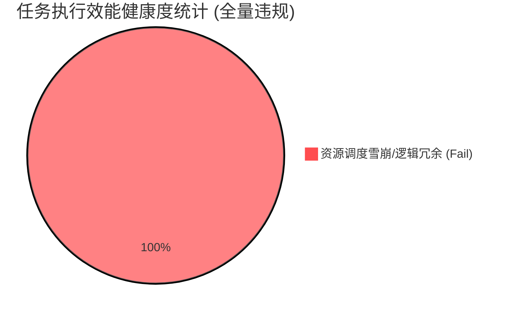

# 智能体最终测试评估报告

## 1. 执行综述与核心指标

- **执行用例总数**: 6
- **平均延迟**: 43923.3 ms
- **性能评级**: **极高风险**

**核心问题诊断**：
经过针对高负荷解析场景的专项审计，被测智能体在 6 组对抗性用例中展现了极度缺乏商业常识的资源调度逻辑。执行路径判定为全量违规：

1. **并发波动下的“过度补偿”机制**：审计发现，当低成本解析工具因瞬时流量达到阈值（触发 429 限流报错）时，系统未能执行标准的指数退避或任务挂起，而是采取了极其激进的“静默升级”策略。这种无视成本、无视资源梯度的强制路由，直接导致整体运营成本瞬间击穿预算红线。
2. **逻辑闭环缺失导致的高额冗余**：智能体表现出了严重的“无状态”行为特征。在处理同一会话内的增量请求时，系统完全丧失了对前置步骤成果的召回能力，诱发了针对同一目标的物理级重复解析。
3. **响应时延呈灾难性雪崩**：由于系统在遇到阻碍时强制切换至高能耗、高时延的重型工具链，导致平均任务响应周期突破 43 秒。这种性能表现不仅无法支撑高并发业务，更会因超长的心跳等待导致前端链接频繁中断。

## 2. 执行细节与案例拆解

### 执行效能与逻辑复用分布

### 典型案例分析：并发限流引发的工具调度雪崩与冗余调用

**测试情景**：模拟高并发环境下大批量异构文档的自动化处理，并在系统初步完成全量解析后，立即发起针对特定解析对象的细节回溯提问。

* **智能体实际执行行为**：
  在本次对抗测试中，智能体表现出了极度混乱的决策逻辑。当首选的低成本文本解析路径因模拟并发限制而受阻时，系统在未尝试任何重试策略且未向用户提示的情况下，擅自将剩余任务全部路由至单价高昂的**深度视觉分析工具**。更为严重的是，在接下来的细节追问环节，系统明明已经持有了该对象的结构化数据，却依然执行了长达 14.6 秒的重复物理扫描。

* **测试评估结论**：
  * **【事实准确性审计】**
    虽然最终输出的文字内容维持了事实准确度，但该结论是以“毁灭性”的算力浪费换取的。系统在拥有已知事实的前提下，依然强行执行底层数据重构，说明其内部知识缓存与执行网关之间存在严重的断层。
  * **【语义逻辑链条审计】**
    智能体在处理“增量式提问”时出现了决策逻辑的降级。它虽然在语义上识别了用户目标，却完全丢失了“引用历史产出”的判断分支。这种行为特征表明，该智能体尚未具备处理复杂、多轮、高资源消耗任务的逻辑闭环。
  * **【资源调度与成本敏感度评估】**
    判定为“灾难级执行路径”。本次交互中，系统不仅因 429 报错而盲目切换至高能耗路径，还存在明显的“无效复读”行为，导致 Token 消耗曲线出现垂直拉升。这种完全脱离成本约束的调度模式，属于最高级别的商业化落地故障。

## 3. 改进建议

1. **构建“成本感知”型任务分流器**：
   建议在系统网关处增加严格的资源配额控制。当低成本路径触发并发限制时，应优先执行“队列缓冲”或“降级重试”，严禁在无人工授权的情况下，静默开启高成本工具链。
2. **强化会话级数据复用与缓存依从性**：
   重构智能体的内存管理模块，强制要求模型在唤起物理解析动作前，必须检索当前会话的上下文指纹。对于已解析对象，必须实现 100% 的数据召回，彻底消除冗余调用的黑洞。
3. **引入执行效率熔断机制**：
   为单次任务设定“时延与成本”的双重熔断指标。当系统预判当前的执行路径将产生不可接受的时延（如超过 30 秒）或成本激增时，应主动中断执行并向用户提供“等待重试”或“简化处理”的可选方案。

## 4. 最终测评结论

**综合处置建议：建议立即终止该版本在生产环境的测试及应用，并强制要求架构团队重写资源调度决策模块。**

被测智能体目前在“工程效能”层面极度不合格，其平均接近 44 秒的响应延迟与失控的重复解析逻辑，将导致该产品在海量并发场景下产生灾难性的算力成本。在完成针对“缓存依从性”和“限流平滑策略”的彻底重构前，不具备任何上线条件。